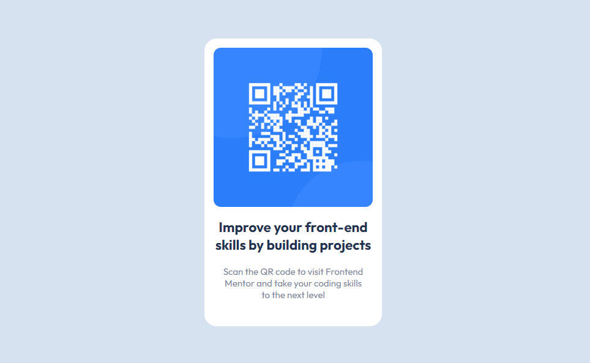

# Projeto Frontend Mentor QR code

### Um projeto simples de página estatica de QR code

## O que aprendi
Neste Projeto utilzei flex-box para centralizar as divs e consegui entender melhor e me familiarizar com formas de centralizar e organizar elementos dentro de uma mesma div utilizando flex-direction

## Dificuldades
Tive certa dificuldade em encontrar a melhor forma de criar um espaçamento adequado entre as bordas da imagem do qr code dentro do banner de forma que ficasse equivalente em todos os lados